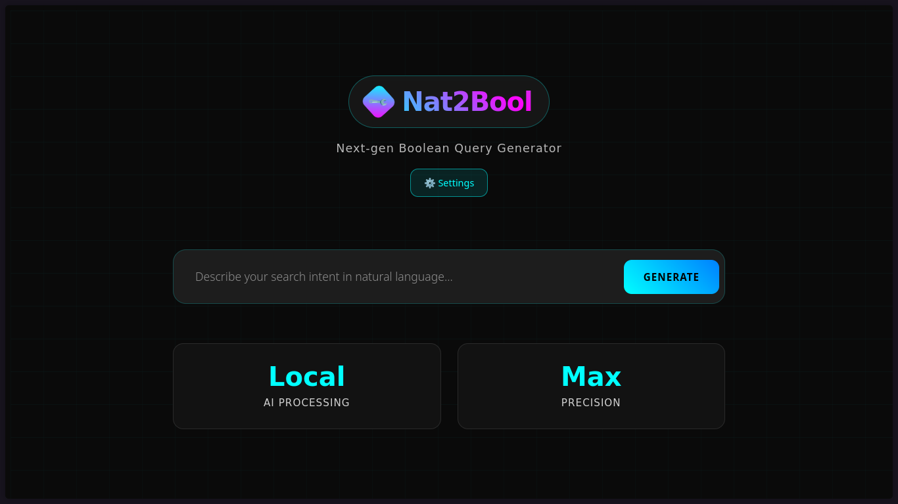

# 🔎 Nat2Bool — Next-Gen Boolean & Advanced Search Query Generator

**Nat2Bool** is a modern web app that helps you transform **natural language queries** into **optimized boolean or advanced search queries**.
Powered by LLMs like **Mistral** or **OpenAI**, it takes plain requests (e.g. *"scientific articles about renewable energy after 2020"*) and generates precise queries for Google, Bing, DuckDuckGo, or any search engine.

🚀 With Nat2Bool, you can go from **"I don’t know search operators"** to **expert-level queries** instantly.

---

## ✨ Features

- 🧠 **LLM-powered query generation**
  Transforms natural language into optimized queries with operators like `AND`, `OR`, `NOT`, `filetype:`, `site:`, `intitle:`…

- ⚙️ **Customizable AI & search engine**
  Choose between **Mistral** or a **local model**. For now  the search engine is Google.

- 🎨 **Beautiful cyberpunk-inspired UI**
  Neon-glow interface with smooth animations and a futuristic vibe.

- 💾 **Persistent settings**
  Your preferences (AI, engine, theme, API key) are saved locally in your browser.

- 🧭 **Smart intent detection**
  - Ask for a famous site → get a direct link
(`"official Apple site"` → `https://www.apple.com`)
  - Ask a simple fact → get a plain search query
(`"weather Paris tomorrow"` → `weather Paris tomorrow`)
  - Ask a research task → get a full boolean query
(`"scientific articles about renewable energy after 2020"` → `"renewable energy" AND "scientific articles" after:2020-01-01`)

---

## 📜 License

This project is licensed under the terms of the **[MIT License](./LICENSE)**.
You are free to use, modify, and distribute this project with proper attribution.
